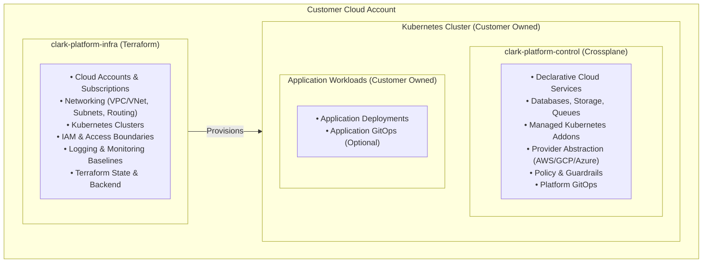
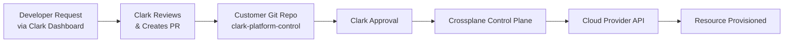

# Clark Platform - Architecture

## Architecture Overview

Clark Platform consists of two core layers that work together to provide managed infrastructure:

1. **Infrastructure Layer** (Terraform)
2. **Control Plane Layer** (Crossplane)

### Baseline Architecture

The baseline architecture assumes a **Kubernetes-based infrastructure model**. This includes:
- Kubernetes clusters for container orchestration
- Traditional compute, storage, and networking resources
- Standard cloud service patterns

### Customization

Clark can customize the infrastructure model to match your specific architecture:

- **Serverless Architecture**: Adapted for serverless-first deployments (Lambda, Functions, etc.)
- **Edge Computing**: Configured for edge and distributed infrastructure
- **Hybrid Cloud**: Multi-cloud and hybrid scenarios
- **Traditional**: Standard Kubernetes-based platform (baseline)

### Existing Infrastructure Import

If you have existing infrastructure, Clark can import all Terraform states upon your request:
- Assessment of existing infrastructure
- Import plan development
- State migration with zero downtime
- Gradual transition to Clark management

## Component Diagram

## Infrastructure Layer: clark-platform-infra

### Purpose

The infrastructure layer uses Terraform to provision and manage foundational cloud infrastructure.

### Responsibilities

- **Cloud Accounts & Subscriptions**: Initial setup and configuration
- **Networking**: VPC/VNet creation, subnets, routing tables, NAT gateways
- **Kubernetes Clusters**: EKS, GKE, AKS cluster provisioning
- **IAM & Access Boundaries**: Service accounts, roles, policies
- **Logging & Monitoring Baselines**: CloudWatch, Cloud Logging, Azure Monitor setup
- **Terraform State & Backend**: State storage and locking

### What It Does NOT Do

- Application deployments
- Runtime operations
- Business logic
- Application-specific configurations

### Technology Stack

- **Terraform**: Infrastructure provisioning
- **Cloud Providers**: AWS, GCP, Azure
- **State Backend**: S3, GCS, Azure Storage (customer-owned)

## Control Plane Layer: clark-platform-control

### Purpose

The control plane layer uses Crossplane to manage cloud services declaratively through Kubernetes.

### Responsibilities

- **Declarative Cloud Services**: Databases, storage, queues, managed services
- **Provider Abstraction**: Unified interface across AWS/GCP/Azure
- **Managed Kubernetes Addons**: Ingress controllers, service meshes, etc.
- **Policy & Guardrails**: OPA policies, resource limits, compliance
- **Platform GitOps**: Git-driven infrastructure changes

### Installation

- Installed on customer Kubernetes cluster
- Managed by Clark operations team
- Accessible to customer development teams

### Usage Model

- **Development Teams**: Request resources/services via Clark dashboard, report incidents, create cases
- **Clark Operations**: Review requests, create PRs, approve changes
- **Crossplane**: Provisions resources automatically

## GitOps Model

### Two GitOps Layers

| Layer | Purpose | Owned By |
|-------|---------|----------|
| Platform GitOps | Infrastructure & cloud services | Clark / Customer ops |
| Application GitOps | Application deployments | Customer teams |

### Platform GitOps Flow

### Application GitOps

Clark does not own or operate application GitOps. This remains the customer's responsibility, though Clark can provide optional support.

## Data Flow

### Infrastructure Provisioning

1. Clark creates Terraform configuration
2. Terraform provisions cloud resources
3. Kubernetes cluster is created
4. Crossplane is installed on the cluster

### Service Provisioning

1. Developer requests service via Clark dashboard (e.g., RDS database)
2. Clark reviews the request
3. Clark creates PR in `clark-platform-control` with service definition
4. Clark approves and merges the PR
5. Crossplane provisions the service
6. Service credentials are stored in Kubernetes secrets

### Application Deployment

1. Customer team deploys application
2. Application consumes services provisioned by Crossplane
3. Application GitOps (if used) manages deployments
4. Clark does not manage application deployments

## Security Architecture

### Access Control

- **Cloud Accounts**: Customer-owned, Clark has operational access
- **Git Repositories**: Customer-owned, Clark has maintainer access
- **Kubernetes**: Customer-owned cluster, Clark manages Crossplane
- **State Backends**: Customer-owned storage, Clark has read/write access

### Network Security

- VPC/VNet isolation
- Private subnets for workloads
- Network policies in Kubernetes
- Cloud provider security groups

### Secrets Management

- Cloud provider secret managers (optional)
- Kubernetes secrets for service credentials
- Vault integration (optional)

## Scalability

### Horizontal Scaling

- Kubernetes clusters scale automatically
- Crossplane handles multiple resource types
- Terraform modules support multiple environments

### Multi-Environment Support

- Development
- Staging
- Production

Each environment has its own:
- Terraform state
- Kubernetes cluster
- Crossplane instance

## Monitoring and Observability

### Infrastructure Monitoring

- Cloud provider native monitoring
- Terraform state tracking
- Crossplane resource status

### Application Monitoring

- Customer responsibility
- Optional Clark support for setup

## Next Steps

- Review [Repository Model](03-repository-model.md) for repository structure
- Read [GitOps Model](04-gitops-model.md) for workflow details
- Check [Security and Access](08-security-and-access.md) for security details

