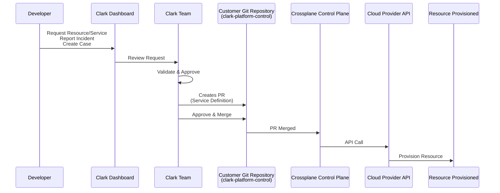
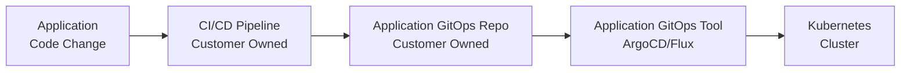

# Clark Platform - GitOps Model

## Overview

Clark Platform uses a GitOps model with two distinct layers: Platform GitOps (managed by Clark) and Application GitOps (managed by customer).

## Clark Dashboard

### Purpose

The Clark dashboard is the primary interface for development teams to interact with the platform. It provides a user-friendly way to request resources, report incidents, and manage cases without requiring direct Git repository access.

### Features

- **Resource Requests**: Request cloud services (databases, storage, queues) via intuitive forms
- **Incident Reporting**: Report infrastructure incidents and issues
- **Case Management**: Create and track support cases
- **Status Tracking**: Monitor request status and resource provisioning
- **Notifications**: Receive updates on request status and resource availability

### Alternative Methods

- **Repository Issues**: Developers can create issues in the repository for requests or questions
- **Direct Communication**: Contact Clark team directly for urgent matters

### Workflow Integration

All requests from the dashboard are processed by Clark, who then creates the necessary PRs in the repository following GitOps best practices.

## Two-Layer GitOps Architecture

### Layer Separation

| Layer | Purpose | Owned By | Managed By |
|-------|---------|----------|------------|
| Platform GitOps | Infrastructure & cloud services | Customer | Clark |
| Application GitOps | Application deployments | Customer | Customer teams |

### Why Two Layers?

- **Clear Boundaries**: Platform vs. application concerns
- **Different Lifecycles**: Infrastructure changes less frequent than application changes
- **Different Expertise**: Platform requires infrastructure expertise
- **Governance**: Platform changes need stricter review

## Platform GitOps

### Purpose

Platform GitOps manages infrastructure and cloud services through Git-driven workflows.

### Critical Boundary

**Clark GitOps applies only to platform and cloud resources, not application deployments.**

This explicit boundary prevents scope creep, clarifies sales conversations, and protects against contractual risk. Application deployments remain customer responsibility.

### Repository

- **Repository**: `clark-platform-control`
- **Technology**: Crossplane
- **Workflow**: Developer Request (Dashboard) → Clark Review → Clark Creates PR → Merge → Apply
- **Scope**: Platform infrastructure and cloud services only

### Workflow



### Example: Requesting a Database

1. **Developer requests via Clark dashboard**:
   - Opens Clark dashboard
   - Selects "Request Database"
   - Fills in details (engine: postgres, version: 14, size: small)
   - Submits request

2. **Clark reviews request**:
   - Checks compliance with policies
   - Verifies resource limits
   - Ensures proper configuration
   - Creates PR in repository:
   ```yaml
   apiVersion: database.example.org/v1alpha1
   kind: Database
   metadata:
     name: my-database
   spec:
     engine: postgres
     version: "14"
     size: small
   ```

3. **Clark merges PR**:
   - Crossplane detects change
   - Provisions database in cloud
   - Updates status in Git

4. **Database available**:
   - Credentials stored in Kubernetes secrets
   - Developer notified via dashboard
   - Developer can use database

### What Platform GitOps Manages

- Cloud databases (RDS, Cloud SQL, etc.)
- Storage buckets
- Message queues
- Managed Kubernetes addons
- Network policies
- IAM roles and policies
- Monitoring and logging setup

### What Platform GitOps Does NOT Manage

- Application code
- Application deployments
- Application configurations
- CI/CD pipelines (unless optional service)

## Application GitOps

### Purpose

Application GitOps manages application deployments through Git-driven workflows.

### Ownership

- **Owned By**: Customer
- **Managed By**: Customer teams
- **Clark Support**: Optional (add-on service)

### Options

- **ArgoCD**: Kubernetes-native GitOps
- **Flux**: CNCF GitOps toolkit
- **Custom**: Customer's existing solution

### Workflow (Customer-Managed)



### Clark's Role in Application GitOps

- **Baseline**: Not included
- **Optional Support**: Can provide setup and maintenance
- **Best Practices**: Can provide guidance
- **Troubleshooting**: Can assist with issues

## GitOps Principles

### 1. Declarative Configuration

All desired state defined in Git:
- Infrastructure as Code
- Configuration as Code
- Policy as Code

### 2. Version Control

Everything in Git:
- Full history
- Rollback capability
- Audit trail

### 3. Automated Sync

Changes automatically applied:
- Continuous reconciliation
- Drift detection
- Self-healing

### 4. Observability

State visible in Git:
- Current state
- Desired state
- Drift detection

## Change Management Process

### Platform Changes

1. **Request**: Developer requests via Clark dashboard (or creates issue in repo)
2. **Review**: Clark team reviews request
   - Policy compliance
   - Resource limits
   - Best practices
3. **Create PR**: Clark creates PR in repository
4. **Approval**: Clark approves and merges PR
5. **Apply**: Crossplane applies changes
6. **Verify**: Status updated in Git and dashboard

### Application Changes

1. **Request**: Developer creates PR
2. **Review**: Customer team reviews
3. **Approval**: Customer approves
4. **Merge**: PR merged
5. **Apply**: Application GitOps applies
6. **Verify**: Deployment status

## Policy and Governance

### Platform Policies

- **Resource Limits**: Size and quantity limits
- **Naming Conventions**: Consistent naming
- **Security Policies**: Access and encryption
- **Cost Controls**: Budget limits

### Enforcement

- **OPA Policies**: Open Policy Agent
- **Crossplane Compositions**: Enforced patterns
- **Git Hooks**: Pre-commit validation
- **CI/CD Checks**: Automated validation

## Benefits of GitOps Model

### For Customers

- **Transparency**: All changes visible in Git
- **Control**: Full ownership of repositories
- **Audit**: Complete change history
- **Rollback**: Easy to revert changes

### For Clark

- **Efficiency**: Automated workflows
- **Safety**: Review before apply
- **Scalability**: Handle multiple customers
- **Documentation**: Git as documentation

### For Development Teams

- **Self-Service**: Request resources via Clark dashboard
- **Incident Reporting**: Report incidents via dashboard
- **Case Management**: Create cases via dashboard
- **Issue Tracking**: Create issues in repository
- **Speed**: Faster than manual processes
- **Consistency**: Standardized patterns
- **Visibility**: Track requests and status in dashboard

## Best Practices

### Platform GitOps

- Small, focused PRs
- Clear commit messages
- Document breaking changes
- Test in development first

### Application GitOps

- Separate repos for apps
- Environment-specific configs
- Automated testing
- Gradual rollouts

## Troubleshooting

### Common Issues

- **Drift Detection**: Resources changed outside Git
- **Sync Failures**: Provider API issues
- **Policy Violations**: Changes rejected by policies
- **Resource Limits**: Quota exceeded

### Resolution

- **Drift**: Reconcile or update Git
- **Sync Failures**: Check provider status
- **Policy Violations**: Update PR to comply
- **Resource Limits**: Request quota increase

## Next Steps

- Review [Repository Model](03-repository-model.md) for repository structure
- Check [Responsibility Matrix](05-responsibility-matrix.md) for ownership
- Read [Optional Services](07-optional-services.md) for GitOps options

