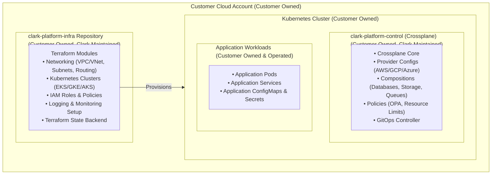
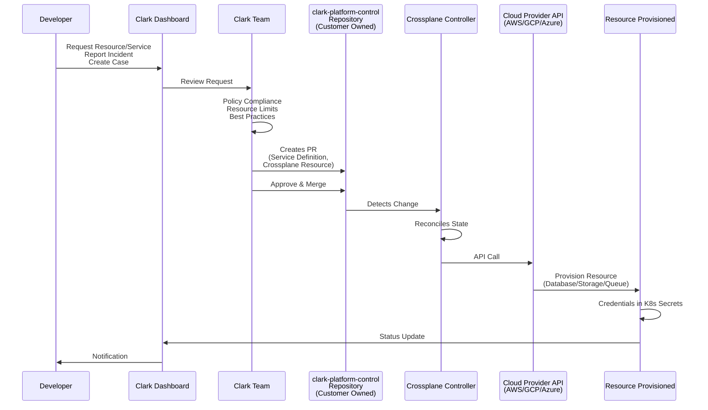
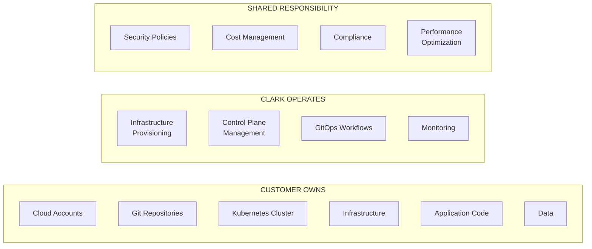
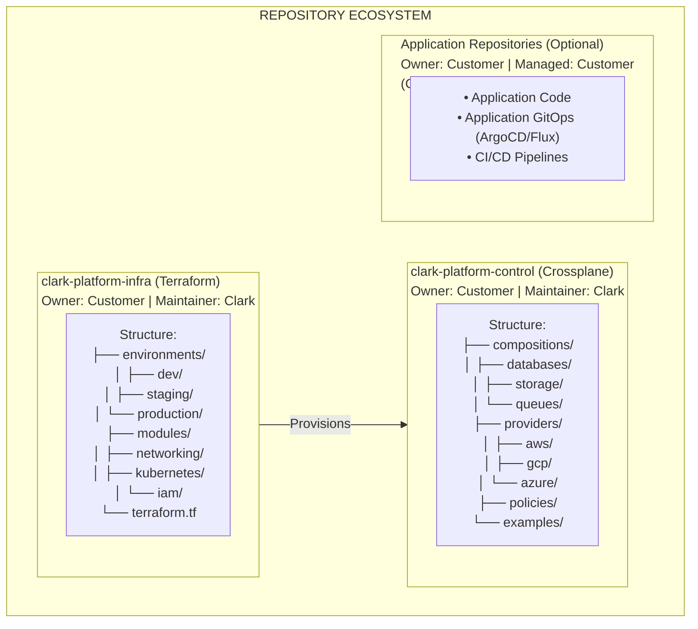
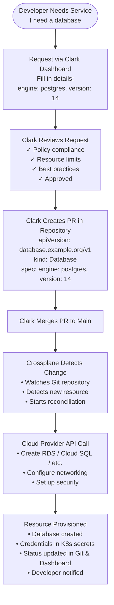
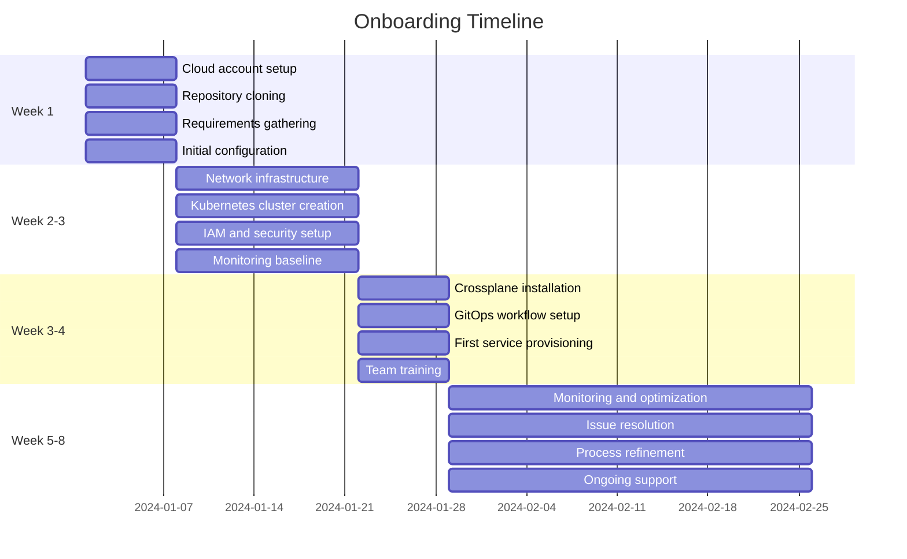

# Clark Platform - Architecture Diagrams

## System Architecture

### High-Level Overview



## GitOps Workflow

### Platform GitOps Flow



## Responsibility Matrix Visual

### Ownership and Operation



## Repository Structure

### Repository Relationships



## Service Provisioning Flow

### End-to-End Service Request



## Access Control Model

### Access Hierarchy

```mermaid
flowchart TD
    subgraph CloudLevel["CLOUD ACCOUNT LEVEL"]
        CloudCust[Customer: Account Owner<br/>Full Control]
        CloudClark[Clark: IAM Role<br/>Operational Access Only<br/>• Infrastructure provisioning<br/>• Resource management<br/>• Monitoring access<br/>• NO billing access<br/>• NO account deletion]
    end
    
    subgraph RepoLevel["REPOSITORY LEVEL"]
        RepoCust[Customer: Repository Owner<br/>Full Control]
        RepoClark[Clark: Maintainer<br/>Can merge PRs, cannot delete]
        RepoDev[Development Teams: Contributor<br/>Can create issues in repo]
    end
    
    subgraph K8sLevel["KUBERNETES CLUSTER LEVEL"]
        K8sCust[Customer: Cluster Admin<br/>Full Control]
        K8sClark[Clark: Service Account<br/>Crossplane Management Only<br/>• crossplane-system namespace: full access<br/>• Resource management: create/update/delete<br/>• NO application namespace access<br/>• NO secret read access (except Crossplane)]
    end
    
    CloudLevel --> RepoLevel
    RepoLevel --> K8sLevel
```

## Optional Services Integration

### Service Add-Ons Architecture

```mermaid
flowchart TB
    subgraph Baseline["BASELINE (Always Included)"]
        Infra[clark-platform-infra<br/>(Terraform)]
        Control[clark-platform-control<br/>(Crossplane)]
        Monitor[Basic monitoring]
    end
    
    subgraph Optional["OPTIONAL SERVICES (Add-Ons)"]
        Secrets[Secrets Management<br/>AWS Secrets Manager<br/>Azure Key Vault<br/>Vault]
        GitOps[App GitOps<br/>ArgoCD / Flux]
        CICD[CI/CD Pipelines<br/>GitHub Actions<br/>GitLab CI]
        Observability[Observability<br/>Prometheus / Grafana]
        Security[Security<br/>OPA / Kyverno]
    end
    
    Baseline --> Optional
```

## Onboarding Timeline

### 4-Week Onboarding Process



## Exit Process Flow

### Customer Exit Journey

```mermaid
flowchart TD
    Start([Customer Notifies<br/>Clark of Exit]) --> Knowledge[Knowledge Transfer<br/>• Documentation review<br/>• Training sessions<br/>• Handover meetings<br/>• Q&A sessions]
    Knowledge --> Access[Access Transfer<br/>• Customer already has full access<br/>• Transfer operational access<br/>• Credential handover<br/>• Access verification]
    Access --> Code[Code & Config Transfer<br/>• Repository access (already owned)<br/>• Configuration export<br/>• State transfer<br/>• Complete documentation package]
    Code --> Support[Support Transition<br/>• Optional transition period<br/>• Support handoff<br/>• Final review and sign-off]
    Support --> End([Exit Complete])
    
    style Start fill:#e1f5ff
    style End fill:#d4edda
```

