# Clark Platform - Real-World Scenario

## Scenario Overview

This document describes a complete real-world scenario of a customer using Clark Platform to manage their cloud infrastructure and deploy applications.

## Customer Profile

**Company**: TechCorp (fictional example)

**Team Size**: 25 engineers

**Architecture**: Microservices

**Applications**:
- Java microservices (backend services)
- Python microservices (data processing, ML services)
- React frontend (single-page application)
- Python services (API gateways, utilities)

**Cloud Provider**: AWS

**Regions**: 3 regions (us-east-1, us-west-2, eu-west-1)

## Initial Setup with Clark

### Phase 1: Infrastructure Provisioning

Clark has completed the baseline setup:


### Repository Structure


## Current Infrastructure State

### AWS Resources (Provisioned via Terraform)

- **EKS Clusters**: 3 clusters (one per region)
- **Networking**: VPCs, subnets, NAT gateways in each region
- **IAM Roles**: Service accounts, cluster access
- **Monitoring**: CloudWatch, logging configured
- **Secrets**: AWS Secrets Manager configured

### Crossplane-Managed Services

- **RDS Databases**: PostgreSQL databases for each service
- **ElastiCache**: Redis clusters for caching
- **S3 Buckets**: Application storage buckets
- **Load Balancers**: Application load balancers

### DevOps Setup

- **GitHub Actions**: Base pipelines provided by Clark
- **Artifactory (JFrog)**: Configured in 3 regions
- **Container Registry**: ECR repositories
- **CI/CD Workflows**: Integrated with Clark pipelines

## Scenario: Deploying New Application Version

### Step 1: Developer Requests Services via Clark Dashboard

The team needs to deploy a new version of their Java microservice and requires additional infrastructure.


### Step 2: Service Definitions Created

Clark creates the following service definitions in the GitOps repository:

**RDS Database Request**:
```yaml
apiVersion: database.aws.crossplane.io/v1alpha1
kind: RDSInstance
metadata:
  name: java-service-db-prod
spec:
  forProvider:
    dbInstanceClass: db.t3.medium
    engine: postgres
    engineVersion: "14.9"
    allocatedStorage: 100
    masterUsername: admin
    vpcSecurityGroupIds:
      - sg-xxxxx
    dbSubnetGroupName: default
  writeConnectionSecretToRef:
    name: java-service-db-credentials
    namespace: default
```

**ElastiCache Request**:
```yaml
apiVersion: cache.aws.crossplane.io/v1alpha1
kind: ReplicationGroup
metadata:
  name: java-service-cache-prod
spec:
  forProvider:
    replicationGroupDescription: Redis cache for Java service
    numCacheClusters: 2
    nodeType: cache.t3.micro
    engine: redis
    engineVersion: "7.0"
  writeConnectionSecretToRef:
    name: java-service-cache-credentials
    namespace: default
```

### Step 3: Application Deployment Workflow

Once infrastructure is ready, the team deploys their applications:

```mermaid
flowchart TD
    Start([Developer Pushes Code]) --> GitHub[GitHub Repository]
    GitHub --> Trigger[GitHub Actions Triggered]
    Trigger --> Build[Build Applications<br/>Java, Python, React]
    Build --> Test[Run Tests]
    Test --> Artifactory[Push to Artifactory<br/>JFrog in 3 Regions]
    Artifactory --> BuildImage[Build Docker Images]
    BuildImage --> ECR[Push to ECR]
    ECR --> Deploy[Deploy to EKS<br/>via Kubernetes Manifests]
    Deploy --> Services[Services Running<br/>• Java microservices<br/>• Python services<br/>• React frontend]
    Services --> LoadBalancer[Load Balancer<br/>Routes Traffic]
    LoadBalancer --> Users[End Users]
    
    style Start fill:#e1f5ff
    style Users fill:#d4edda
```



### Step 4: Multi-Region Architecture


## Complete Workflow: New Version Deployment

### End-to-End Process


## Detailed Component Interactions

### Infrastructure Layer (Terraform)

**Managed by**: `clark-platform-infra` repository

**Resources**:
- EKS clusters in 3 regions
- VPCs, subnets, routing
- IAM roles and policies
- Security groups
- CloudWatch logging

**State**: Stored in S3 (customer-owned)

### Control Plane Layer (Crossplane)

**Managed by**: `clark-platform-control` repository

**Compositions Available**:
- Database compositions (RDS, Aurora)
- Cache compositions (ElastiCache)
- Storage compositions (S3)
- Networking compositions (Load Balancers)

**GitOps Repository**: Separate repo for service definitions

### Application Layer

**Owned by**: Customer

**Components**:
- Java microservices (Spring Boot)
- Python microservices (FastAPI, Django)
- React frontend (Next.js)
- Python utility services

**Deployment**: Via GitHub Actions pipelines (Clark-maintained base)

## Service Request Example: Scaling RDS

### Request via Dashboard

Developer requests scaling existing RDS database:

1. **Dashboard Request**:
   - Service: Existing RDS database
   - Action: Scale up
   - New Size: db.t3.large
   - Region: us-east-1

2. **Clark Review**:
   - Validates request
   - Checks resource limits
   - Approves change

3. **PR Creation**:
   ```yaml
   apiVersion: database.aws.crossplane.io/v1alpha1
   kind: RDSInstance
   metadata:
     name: java-service-db-prod
   spec:
     forProvider:
       dbInstanceClass: db.t3.large  # Changed from db.t3.medium
   ```

4. **Crossplane Execution**:
   - Detects change
   - Updates RDS instance class
   - Performs zero-downtime scaling
   - Updates status

5. **Notification**:
   - Dashboard updated
   - Developer notified
   - Service ready with new capacity

## DevOps Pipeline Integration

### GitHub Actions Workflow


### Pipeline Configuration

**Base Pipeline** (Clark-provided):
```yaml
name: Clark Base Pipeline

on:
  push:
    branches: [main, develop]

jobs:
  build:
    runs-on: ubuntu-latest
    steps:
      - uses: actions/checkout@v3
      - name: Setup Java
        uses: actions/setup-java@v3
      - name: Setup Python
        uses: actions/setup-python@v4
      - name: Setup Node.js
        uses: actions/setup-node@v3
      - name: Build
        run: |
          # Clark base build steps
      - name: Push to Artifactory
        run: |
          # Push to JFrog in all regions
      - name: Build and Push Docker
        run: |
          # Build images and push to ECR
      - name: Deploy to EKS
        run: |
          # Deploy using kubectl
```

**Customer Extends**:
- Application-specific tests
- Custom build steps
- Environment-specific configs

## Multi-Region Artifactory Setup

### Architecture


### Benefits

- **Low Latency**: Each region pulls from local Artifactory
- **High Availability**: Redundancy across regions
- **Disaster Recovery**: Regional failover capability
- **Compliance**: Data residency requirements met

## Secrets Management Flow

### AWS Secrets Manager Integration


### Secret Types Managed

- **Database Credentials**: RDS connection strings, passwords
- **Cache Credentials**: ElastiCache endpoints, auth tokens
- **Application Secrets**: API keys, service tokens
- **Registry Credentials**: ECR, Artifactory access

## Complete Request Flow: New Service

### Scenario: Team Needs New Microservice

```mermaid
flowchart TD
    Start([Team Needs New Service]) --> Request[Request via Clark Dashboard<br/>• New RDS database<br/>• New ElastiCache<br/>• New S3 bucket]
    
    Request --> Review[Clark Reviews Request<br/>• Policy compliance<br/>• Resource limits<br/>• Best practices]
    
    Review --> CreatePR[Clark Creates PR<br/>in GitOps Repository]
    
    CreatePR --> Merge[Clark Merges PR]
    
    Merge --> Crossplane[Crossplane Detects Change]
    
    Crossplane --> Provision[Provision Resources<br/>• RDS database<br/>• ElastiCache cluster<br/>• S3 bucket]
    
    Provision --> Secrets[Store Credentials<br/>in AWS Secrets Manager]
    
    Secrets --> Notify[Dashboard Notification<br/>Services Ready]
    
    Notify --> Dev[Developer Receives<br/>Credentials & Endpoints]
    
    Dev --> Deploy[Deploy Application<br/>via GitHub Actions]
    
    Deploy --> Connect[Application Connects<br/>to Services]
    
    Connect --> Running[Service Operational]
    
    style Start fill:#e1f5ff
    style Running fill:#d4edda
```



## Scaling Existing Services

### Request Scaling via Dashboard

```mermaid
flowchart LR
    Dev[Developer] --> Dash[Clark Dashboard<br/>Select Existing Service]
    Dash --> Scale[Request Scale Operation<br/>• RDS: db.t3.medium → db.t3.large<br/>• ElastiCache: Add nodes<br/>• EKS: Scale node group]
    Scale --> Review[Clark Reviews]
    Review --> Update[Update GitOps Repo]
    Update --> XP[Crossplane Applies]
    XP --> AWS[Resources Scaled]
    AWS --> Complete[Scaling Complete<br/>Zero Downtime]
    
    style Dev fill:#e1f5ff
    style Complete fill:#d4edda
```



## Application Deployment Process

### Complete Deployment Flow

```mermaid
flowchart TB
    subgraph Dev["Development"]
        Code[Developer Writes Code] --> Commit[Commit to GitHub]
    end
    
    subgraph CI["Continuous Integration"]
        Commit --> Trigger[GitHub Actions Triggered]
        Trigger --> Build[Build Applications<br/>• Java: Maven/Gradle<br/>• Python: pip/poetry<br/>• React: npm build]
        Build --> Test[Run Test Suite]
        Test --> Quality[Code Quality Checks]
    end
    
    subgraph Artifact["Artifact Management"]
        Quality --> Artifactory[Push to Artifactory<br/>JFrog - All 3 Regions]
        Artifactory --> Docker[Build Docker Images<br/>• Java service image<br/>• Python service image<br/>• React frontend image]
        Docker --> ECR[Push to ECR<br/>All 3 Regions]
    end
    
    subgraph CD["Continuous Deployment"]
        ECR --> K8s[Deploy to EKS<br/>via kubectl/Helm]
        K8s --> Secrets[Read Credentials<br/>from Secrets Manager]
        Secrets --> Health[Health Checks]
        Health --> LB[Update Load Balancer]
        LB --> Live[Application Live]
    end
    
    Code --> Commit
    Live --> Monitor[Monitor via<br/>CloudWatch & Dashboard]
    
    style Code fill:#e1f5ff
    style Live fill:#d4edda
```



## Service Dependencies

### Application Service Map


## Clark Dashboard Features Used

### Dashboard Capabilities

1. **Resource Requests**
   - Request new databases
   - Request new caches
   - Request storage buckets
   - Request load balancers

2. **Service Management**
   - View all provisioned services
   - Check service status
   - View service metrics
   - Access service endpoints

3. **Scaling Operations**
   - Scale RDS instances
   - Scale ElastiCache clusters
   - Scale EKS node groups
   - Adjust service capacity

4. **Incident Management**
   - Report infrastructure incidents
   - Track incident resolution
   - View incident history

5. **Case Management**
   - Create support cases
   - Request custom configurations
   - Ask questions
   - Track case status

## Repository Ownership Model

### Who Owns What


## Complete Infrastructure Map

### Full Stack Overview


## Key Takeaways

### What Clark Provides

✅ **Infrastructure Management**
- EKS clusters provisioned and maintained
- Networking configured
- IAM properly set up
- Multi-region support

✅ **Service Management**
- RDS databases on-demand
- ElastiCache clusters
- S3 buckets
- Load balancers

✅ **DevOps Support**
- Base pipelines maintained
- Artifactory configured
- Multi-region artifact distribution
- ECR integration

✅ **Secrets Management**
- AWS Secrets Manager configured
- Automatic credential rotation
- Kubernetes integration
- Secure credential distribution

### What Customer Owns

✅ **All Repositories**
- Infrastructure code
- Control plane code
- GitOps definitions
- Application code

✅ **All AWS Resources**
- Cloud accounts
- All provisioned resources
- Data and applications

✅ **Full Control**
- Can scale services
- Can modify configurations
- Can exit anytime

### Workflow Benefits

🚀 **Speed**: Services provisioned in minutes via dashboard
🛡️ **Safety**: All changes reviewed and validated
📊 **Visibility**: Full transparency in Git repositories
🔄 **Automation**: GitOps ensures consistency
🔐 **Security**: Secrets managed securely
🌍 **Multi-Region**: Global infrastructure support

## Next Steps

After this scenario, the team can:

1. **Scale Services**: Request scaling via dashboard
2. **Add Services**: Request new databases, caches, storage
3. **Deploy Applications**: Use existing pipelines
4. **Monitor**: View metrics in dashboard
5. **Report Issues**: Use dashboard for incidents
6. **Request Help**: Create cases for support

All while maintaining full ownership and control of their infrastructure.

