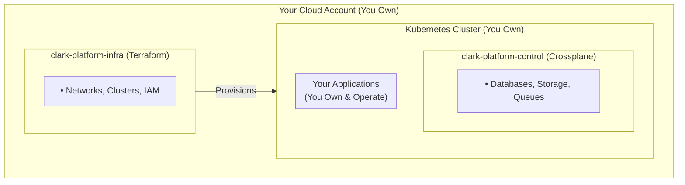
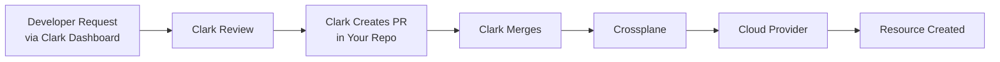

# Clark Platform - Sales & Onboarding Presentation

## Slide 1: Title

# Clark Platform
## Managed Platform Engineering Service

*Provision and operate cloud infrastructure while you retain full ownership*

---

## Slide 2: The Problem

### Infrastructure Complexity is Slowing You Down

- **Time to Market**: Building platform capabilities takes months
- **Expertise Gap**: Platform engineering requires specialized skills
- **Operational Overhead**: Maintaining infrastructure diverts focus from product
- **Cost**: Hiring platform engineers is expensive
- **Risk**: Infrastructure mistakes are costly

**Result**: Startups spend too much time on infrastructure, not enough on product

---

## Slide 3: The Solution

### Clark: Your Embedded Platform Team

Clark provides structure, safety, and speed — not control.

**What We Do**:
- Provision and manage cloud infrastructure
- Operate your platform control plane
- Maintain GitOps workflows
- Provide expert support

**What You Keep**:
- Full ownership of cloud accounts
- Full ownership of repositories
- Full ownership of infrastructure
- Complete exit capability

---

## Slide 4: How Clark Works

### Two Core Repositories, Fully Owned by You

| Repository | Purpose | Ownership |
|------------|---------|-----------|
| **clark-platform-infra** | Foundational infrastructure via Terraform | You own, we operate |
| **clark-platform-control** | Cloud services via Crossplane | You own, we operate |

**Key Principle**: You own everything, we maintain it

---

## Slide 5: Architecture Overview

---

## Slide 6: What's Included

### Baseline Service

✅ **Infrastructure Layer**
- Cloud account setup
- Networking (VPC/VNet, subnets)
- Kubernetes clusters
- IAM and security
- Monitoring baselines

✅ **Control Plane Layer**
- Crossplane installation
- Cloud service management
- GitOps workflows
- Policy enforcement

✅ **Operations**
- 24/7 monitoring
- Incident response
- Documentation
- Training

---

## Slide 7: What's NOT Included

### Clear Boundaries

❌ **Application Layer**
- Application code
- Application deployments
- Application CI/CD (optional)
- Application monitoring (optional)

**Why**: You focus on product, we focus on platform

---

## Slide 8: GitOps Model

### Two Layers, Clear Separation

**Platform GitOps** (We Manage)
- Infrastructure changes
- Cloud service provisioning
- Policy updates

**Application GitOps** (You Manage)
- Application deployments
- Application configurations
- Your CI/CD

**Workflow**:

---

## Slide 9: Optional Services

### Add What You Need, When You Need It

| Service | Options |
|---------|---------|
| **Secrets** | AWS Secrets Manager, Azure Key Vault, Vault |
| **App GitOps** | ArgoCD, Flux |
| **CI/CD** | GitHub Actions, GitLab CI |
| **Observability** | Prometheus, Grafana |
| **Security** | OPA, Kyverno |

**Principle**: Start simple, add complexity as needed

---

## Slide 10: Control Boundaries

### Who Owns What?

| Area | You | Clark |
|------|-----|-------|
| Cloud accounts | ✅ | ❌ |
| Infrastructure code | ✅ Own | ✅ Maintain |
| Application code | ✅ | ❌ |
| CI/CD | ✅ | Optional |
| Exit capability | ✅ Always | ✅ Guaranteed |

**No Vendor Lock-In**: You can always take full control

---

## Slide 11: The Clark Advantage

### Why Choose Clark?

🚀 **Speed**
- Weeks to production, not months
- Expert team, proven patterns
- Fast iteration

🛡️ **Safety**
- Best practices built-in
- Security by default
- Compliance support

💰 **Cost Effective**
- No hiring costs
- No training costs
- Predictable pricing

🎯 **Focus**
- You build product
- We manage platform
- Everyone wins

---

## Slide 12: Customer Ownership

### You Own Everything

✅ **Cloud Accounts**: Full ownership and control
✅ **Repositories**: Full ownership and control
✅ **Infrastructure**: Full ownership of all resources
✅ **Data**: Complete data ownership
✅ **Exit**: Can exit anytime, no lock-in

**Trust Through Ownership**: We operate, you own

---

## Slide 13: Exit Strategy

### Always Available, Always Yours

**Exit Process**:
1. **Knowledge Transfer**: Complete documentation and training
2. **Access Transfer**: You already have full access
3. **Code Transfer**: All code in your repositories
4. **Support Transition**: Optional transition support

**Timeline**: 2-4 weeks standard, faster if needed

**No Penalties**: Exit anytime, no lock-in periods

---

## Slide 14: Onboarding Process

### From Zero to Production in 4 Weeks

**Week 1**: Setup & Preparation
- Account setup
- Repository cloning
- Requirements gathering

**Week 2-3**: Infrastructure Provisioning
- Network setup
- Kubernetes cluster
- Baseline services

**Week 3-4**: Control Plane & Training
- Crossplane installation
- GitOps setup
- Team training

**Week 5-8**: Stabilization
- Monitoring
- Optimization
- Support

---

## Slide 15: Use Cases

### Who Benefits from Clark?

✅ **Early-Stage Startups**
- Need infrastructure fast
- Limited platform expertise
- Focus on product

✅ **Growing Companies**
- Scaling infrastructure
- Need expert guidance
- Want to focus on growth

✅ **Teams Building Platform Capability**
- Learn from experts
- Gradual transition
- Knowledge transfer

---

## Slide 16: Pricing Model

### Predictable, Transparent Pricing

**Baseline Service**:
- Monthly subscription
- Based on infrastructure scale
- Predictable costs

**Optional Services**:
- One-time setup fee
- Monthly maintenance
- Usage-based (where applicable)

**No Hidden Costs**: Transparent pricing, detailed billing

---

## Slide 17: Why Now?

### The Right Time for Managed Platform Engineering

🌍 **Market Trends**
- Cloud adoption accelerating
- Kubernetes becoming standard
- GitOps best practice

💼 **Business Needs**
- Faster time to market
- Cost optimization
- Focus on core business

🔧 **Technology Maturity**
- Terraform mature
- Crossplane production-ready
- GitOps proven

---

## Slide 18: Team & Expertise

### Experienced Platform Engineers

✅ **Infrastructure Expertise**: Years of cloud infrastructure experience
✅ **Kubernetes Mastery**: Deep Kubernetes knowledge
✅ **GitOps Best Practices**: Proven GitOps workflows
✅ **Multi-Cloud**: AWS, GCP, Azure experience
✅ **Security Focus**: Security-first approach

**Your Embedded Team**: Expert platform engineers working for you

---

## Slide 19: Success Stories

### What Customers Say

> "Clark got us to production in 3 weeks. We would have taken 3 months."

> "We own everything, but Clark makes it work. Perfect balance."

> "Finally, a platform service that doesn't lock us in."

**Results**: Faster time to market, lower costs, better focus

---

## Slide 20: Next Steps

### Getting Started

1. **Discovery Call**: Understand your needs
2. **Proposal**: Customized proposal
3. **Onboarding**: 4-week onboarding process
4. **Production**: You're live and running

**Contact**: Let's discuss how Clark can help you

---

## Slide 21: Questions?

### Let's Talk

**Common Questions**:
- How does pricing work?
- What if we want to exit?
- Can we customize services?
- What about compliance?

**We're Here to Help**: Let's discuss your specific needs

---

## Appendix: Technical Details

### For Technical Audiences

**Technology Stack**:
- Terraform for infrastructure
- Crossplane for control plane
- Kubernetes for orchestration
- GitOps for workflows

**Cloud Providers**:
- AWS
- Google Cloud Platform
- Microsoft Azure

**Security**:
- Encryption at rest and in transit
- Least privilege access
- Regular security audits
- Compliance support

---

## Appendix: Comparison

### Clark vs. Alternatives

| Aspect | Clark | DIY | Other Vendors |
|--------|-------|-----|---------------|
| Ownership | ✅ Full | ✅ Full | ❌ Limited |
| Expertise | ✅ Expert | ❌ Learn | ✅ Expert |
| Speed | ✅ Fast | ❌ Slow | ✅ Fast |
| Cost | ✅ Predictable | ❌ High | ❌ Variable |
| Exit | ✅ Easy | ✅ N/A | ❌ Difficult |
| Lock-in | ❌ None | ❌ None | ✅ High |

---

## Appendix: Roadmap

### Future Enhancements

**Under Consideration**:
- Service mesh support
- API gateways
- Enhanced backup/DR
- Cost optimization tools

**Your Input Matters**: We build what customers need

---

## Closing

### Clark Platform

**Managed Platform Engineering with Full Customer Ownership**

- ✅ You own everything
- ✅ We operate expertly
- ✅ Exit anytime
- ✅ Focus on product

**Let's Build Together**

